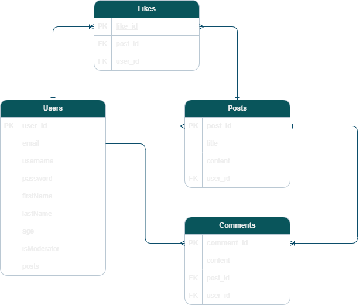

# LoosenUp

LoosenUp is a project inspired by the popular social media platform Twitter. This project aims to recreate some of the key features and functionalities of Twitter, allowing users to share their thoughts.

# Technology

## Node.js

- JavaScript runtime environment that enables JavaScript code to run on the server-side.

## Frontend

- React: JavaScript library for building user interfaces.
- MUI: React UI library for building responsive user interfaces.
- jwt-decode: A library to decode JWT.

## Backend

- Express: Build the server-side of the application and handles the HTTP requests and define the routes.
- bcrypt: A password hashing tool.
- jsonwebtoken: To generate and verify JSON Web Tokens.
- Prisma: An Object-Relational Mapping tool that simplifies database access and management in the application.
- uuid: Generate Universally Unique Indentifiers.

## Database

- PostgreSQL: An open-source relational database management system that provides a wide range of features.

# General Approach

Basic Features:

- User register and login system.
- Profile page for users to manage their personal information.
- Post creation feature for users to share their thoughts.
- Allow users to view other posts.
- Introduce a moderator role to moderate the content in the application.

User interface:

- Design inspiration from Twitter.
- Create a simple layout for navigation.

### Initial ERD:



# Installation

1. Ensure that you have Node.js and npm(Node Package Manager) installed on your machine.

2. Clone the project repo and navigate to the project's root directory(frontend/backend).

3. Install the project dependencies:

   ```
   npm install
   ```

4. This command will install all the required dependencies listed in the `package.json` file.

## Challenges

Using an ORM(Prisma)

- Prisma is a powerful tool and it has its own concepts which was initially tough for me to grasp. It took me some time to understand some of the syntax and also the schema relations.
- At some point, I realized that I was spending too much time ensuring that my prisma models were correctly formatted and had to move on first.
- However, I do feel that this tool does improve productivity by allowing me to write database queries using a familiar syntax, but you would need to spend some time reading and understanding the documentation.

Scope creep

- I feel that I did not plan things properly or have a set direction for the things that needed to be done, which was very inefficient and led to me playing catch-up.
- I was also undecisive in deciding which sequence of the project needed to be prioritized.
